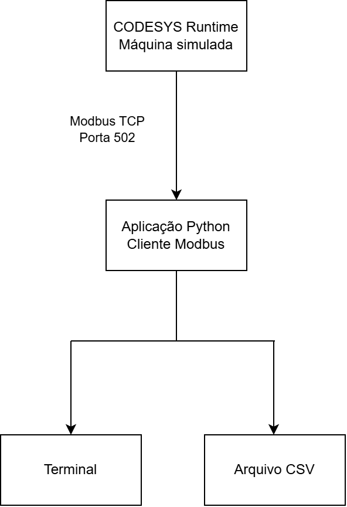

# Arquitetura do sistema

## Visão geral

A solução utiliza uma arquitetura simples de aquisição de dados industriais.



## Componentes e responsabilidades

| Componente | Responsabilidade |
|---|---|
| CODESYS Runtime | Executar a lógica e simular a máquina |
| Servidor Modbus TCP | Disponibilizar os dados do processo |
| Aplicação Python | Ler, converter e apresentar os dados |
| Módulo CSV | Registrar o histórico |
| Terminal | Apresentar os valores atuais |

## Comunicação

| Parâmetro | Valor |
|---|---|
| Protocolo | Modbus TCP |
| Papel do CODESYS | Servidor |
| Papel do Python | Cliente |
| Porta | 502 |
| Unit ID | 1 |
| Área utilizada | Input Registers |
| Primeiro endereço | 0 |
| Quantidade lida | 4 registradores |

## Fluxo de dados

```text
PLC_PRG
   ↓
GVL_Modbus
   ↓
Modbus TCP Server
   ↓
pyModbusTCP
   ↓
Aplicação Python
   ├── Terminal
   └── CSV
